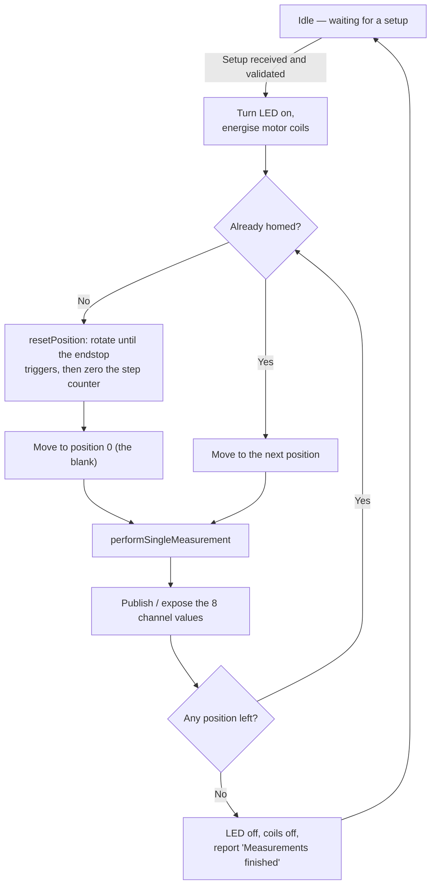

# Smart-Pad

**Smart-Pad** is an open-source, 3D-printed, automated optical reader for colorimetric assays.

A stepper motor rotates a circular sample plate underneath an **AS7341 11-channel spectral
sensor**. For every position the plate stops, the sensor's white LED illuminates the sample and
the light returned by it is recorded in **8 wavelength bands (415, 445, 480, 515, 555, 590, 630
and 680 nm)**. The result of each sample is either the raw sensor counts or an absorbance value
calculated against a blank, and it is sent to your phone/computer over Wi-Fi.

Everything is controlled by an **ESP32**, and the whole build is designed to be reproducible by
someone with no electronics background: print the parts, make about a dozen soldered
connections, install two free programs and click one button to load the firmware.

> **No programming knowledge is required to build and use the device.** Section 5 explains how
> the code works only for those who want to modify or calibrate it.

---

## Table of contents

1. [Choosing a firmware version: MQTT or Web server](#1-choosing-a-firmware-version-mqtt-or-web-server)
2. [Bill of materials](#2-bill-of-materials)
3. [Step 1 — Print the parts](#3-step-1--print-the-parts)
4. [Step 2 — Wire the electronics](#4-step-2--wire-the-electronics)
5. [Step 3 — Flash the firmware onto the ESP32](#5-step-3--flash-the-firmware-onto-the-esp32)
6. [Step 4 — Run a measurement](#6-step-4--run-a-measurement)
7. [Step 5 — How the code works](#7-step-5--how-the-code-works)
8. [Troubleshooting](#8-troubleshooting)
9. [License](#9-license)

---

## 1. Choosing a firmware version: MQTT or Web server

This repository contains **two independent firmwares** for exactly the same hardware. You build
the device once, then choose which of the two programs to load onto the ESP32. You can switch
between them at any time by simply flashing the other one — nothing in the hardware changes.

**The measurement itself is identical in both.** Same pinout, same homing routine, same plate
map, same number of readings per sample, same filtering, same absorbance maths, same validation
limits. The only thing that differs is **how the device talks to you**:

| | **`WEBSERVER VERSION`** | **`MQTT VERSION`** |
|---|---|---|
| **How you talk to it** | The ESP32 **creates its own Wi-Fi network**. You connect your phone or laptop to it and open a web page hosted by the device. | The ESP32 **joins your existing Wi-Fi** and exchanges short text messages with an MQTT broker (a small message server). |
| **Infrastructure needed** | None. | A Wi-Fi network + an MQTT broker running somewhere (e.g. Mosquitto on a PC or Raspberry Pi). |
| **User interface** | A ready-made control page with sliders and a results panel (built into the firmware, no app to install). | None included — you use any MQTT client (MQTT Explorer, Node-RED, Home Assistant, a Python script…). |
| **Internet / lab network** | Works anywhere, even with no network at all (a field or a fume hood with no coverage). | Requires the device and your computer to be on the same network as the broker. |
| **Data logging** | Manual — you read the numbers off the web page, which shows one position at a time. | Automatic — every result is published as it is measured, so anything subscribed to the topic keeps the full run. |
| **Multiple devices** | One device = one Wi-Fi network to connect to; you must switch networks to change device. | Many devices can publish to the same broker at once and be monitored from one screen. |
| **Diagnostics** | Serial monitor over USB (115200 baud). | Published to the `Debug` and `Notifications` topics — readable over the air. |
| **Remote firmware update** | No. | Yes (ElegantOTA — update over Wi-Fi at `http://<device-ip>/update`). |
| **Difficulty** | ⭐ Easiest — start here | ⭐⭐ Requires setting up a broker |

**Which one should I use?**

- **You just want to measure samples** → use the **Web server version**. It is self-contained:
  turn the device on, connect your phone to it, press a button, read the numbers.
- **You want the data to be logged automatically**, to run several Smart-Pads in a lab, or to
  integrate the readings into an existing system → use the **MQTT version**.

Because the measurement code is shared, a plate calibration (§7.4) done on one version is valid
on the other, and readings taken with either firmware are directly comparable.

---

## 2. Bill of materials

### Electronics

| Qty | Component | Notes |
|:---:|---|---|
| 1 | **ESP32 DevKit V1** (30 or 38 pin) | The "brain". Any common ESP32 DevKit board works. |
| 1 | **AS7341** spectral sensor breakout | The detector. Must have the on-board white LED (Adafruit and most clones do). |
| 1 | **28BYJ-48 stepper motor (5 V)** + **ULN2003 driver board** | Usually sold together as a kit. Rotates the sample plate. |
| 1 | **KY-010 photo-interrupter module** | Optical endstop — tells the device where "position zero" is. |
| 1 | **PD/QC/AFC Fast-Charge Decoy Trigger module (Type-C)** | Turns any USB-C phone charger into a 5 V power supply for the device. |
| 1 | USB-C charger, **5 V, 2 A or more** | Powers the whole device through the decoy module. |
| 1 | USB **data** cable for the ESP32 (micro-USB or USB-C) | Needed only to load the firmware. Many cheap cables are charge-only and will *not* work. |
| — | Thin wires (AWG 24–26) and solder | About a dozen connections. Dupont jumper wires also work but are less reliable. |

### Printed parts

9 STL files, listed in [Step 1](#3-step-1--print-the-parts). One standard 1 kg spool of filament
is more than enough for the whole set.

### Tools

Soldering iron, side cutters, a small screwdriver, and a 3D printer (or a printing service).

---

## 3. Step 1 — Print the parts

All models are in the `3D PIECES TO PRINT/` folder, already in **STL** format — drop them
straight into your slicer (Cura, PrusaSlicer, Bambu Studio, Orca…).

### 3.1 Parts list

| File | Qty | Footprint (X × Y × Z, mm) | What it is |
|---|:---:|---|---|
| `BODY/SampleBase.stl` | 1 | 184 × 176 × 46 | Main chassis. The sample plate sits on it. **Largest part.** |
| `BODY/EletronicsBase.stl` | 1 | 184 × 166 × 43 | Compartment underneath that holds the ESP32, the driver board and the power module. |
| `BODY/SamplePlate.stl` | 1 | 140 × 140 × 11.4 | The rotating carousel that carries your samples. |
| `BODY/MotorConnector.stl` | 1 | 60 × 60 × 11.6 | Couples the 28BYJ-48 shaft to the sample plate. |
| `BODY/Cover.stl` | 1 | 166 × 166 × 30 | Lid that closes the device and keeps ambient light out. |
| `BODY/Sensor_Hinge v11.stl` | 1 | 28.7 × 24 × 10 | Hinge that holds the sensor head above the plate. |
| `SENSOR CASE/base.stl` | 1 | 44 × 26.5 × 16 | Bottom half of the AS7341 enclosure. |
| `SENSOR CASE/lid.stl` | 1 | 44 × 22.3 × 2.9 | Top half of the AS7341 enclosure. |
| `SENSOR CASE/Corpo3.stl` | 1 | 18 × 12 × 10.5 | Small rectangular block that fits inside the sensor case (light shield / spacer). |

> **Printer size check:** the largest parts need a bed of at least **190 × 180 mm**. A standard
> Ender-3 / Prusa i3 class printer (220 × 220 mm) is fine. A Prusa Mini (180 × 180 mm) is **not**
> big enough for `SampleBase.stl` or `EletronicsBase.stl`.

### 3.2 Recommended print settings

| Setting | Value | Why |
|---|---|---|
| **Material** | PLA or PETG | PETG if the device will sit somewhere warm. |
| **Colour** | **Black or another opaque dark colour** | This is an *optical* instrument. Light-coloured or translucent filament lets ambient light leak into the measurement chamber and will degrade your results. This matters most for `SampleBase`, `SamplePlate`, `Cover` and the sensor case. |
| **Layer height** | 0.2 mm | Good balance of speed and detail. |
| **Walls / perimeters** | 3 | Rigidity — the plate must not flex. |
| **Infill** | 20–25 % | |
| **Supports** | On, "touching build plate" | Check the slicer preview for each part: the hinge and the sensor case have small overhangs. |
| **Brim** | Recommended on the tall parts | Prevents the big flat parts from lifting at the corners. |

**Orientation:** print every part with its largest flat face on the bed. `SamplePlate` and
`Cover` should be printed flat (they are essentially discs). Print the sensor case `base` with
its open side up.

**Dimensional accuracy matters** for `MotorConnector` (it must grip the motor shaft) and for
`SamplePlate` (its holes must line up with the sensor). If your printer over-extrudes, the shaft
hole may come out too tight — a light pass with a hobby knife or a drill bit is normally enough.

Expect roughly a full day of printing (~20–30 h) for the complete set on a typical FDM printer;
your slicer will give the exact figure.

---

## 4. Step 2 — Wire the electronics

The system runs on a single 5 V rail. The USB-C decoy module negotiates 5 V from a phone
charger, feeds the ESP32 and the motor driver, and the ESP32's own 3.3 V regulator then powers
the two sensors.

### 4.1 Power distribution (the 5 V rail)

```
        USB-C wall charger  —  5 V, 2 A or more
                        │
                        │  USB-C cable
                        ▼
          ┌────────────────────────────┐
          │   PD/QC/AFC decoy module   │
          │      set to 5 V output     │
          └────┬──────────────────┬────┘
            5V │                  │ GND
               │                  │
               ├──► ESP32   VIN   ├──► ESP32   GND
               │                  │
               └──► ULN2003  +    └──► ULN2003  −


   The ESP32's own 3.3 V regulator then powers the two sensors:

          ESP32 3V3 ──┬──► AS7341 VIN            ESP32 GND ──┬──► AS7341 GND
                      └──► KY-010 + (middle)                 └──► KY-010 −
```

### 4.2 Signal connections

```
                            ESP32 DevKit V1
                        ┌───────────────────────┐
      ULN2003  IN1 ◄────┤ GPIO27         GPIO21 ├────► AS7341  SDA
      ULN2003  IN2 ◄────┤ GPIO25         GPIO22 ├────► AS7341  SCL
      ULN2003  IN3 ◄────┤ GPIO33                │
      ULN2003  IN4 ◄────┤ GPIO32            3V3 ├──┬─► AS7341  VIN
                        │                       │  └─► KY-010  + (middle pin)
      KY-010     S ─────┤ GPIO18                │
                        │                   GND ├──┬─► AS7341  GND
      5 V from decoy ──►┤ VIN                   │  └─► KY-010  −
      GND from decoy ──►┤ GND                   │
                        └───────────────────────┘

      ULN2003 white 5-pin connector ──────► 28BYJ-48 stepper motor
```

The ESP32 DevKit has several `GND` pins and they are all connected internally — use whichever is
most convenient. The `3V3` pin is an **output** from the on-board regulator; never feed 5 V into
it.

### 4.3 Connection tables

**Power — USB-C decoy module → everything else**

| Decoy module | Goes to |
|---|---|
| `+` / `5V` output | ESP32 **`VIN`** pin (labelled `5V` on some boards) |
| `+` / `5V` output | ULN2003 **`+`** terminal |
| `−` / `GND` output | ESP32 **`GND`** pin |
| `−` / `GND` output | ULN2003 **`−`** terminal |

Most decoy modules select their output voltage with a small button or a solder jumper — set it
to **5 V** and confirm with a multimeter *before* connecting anything else. Feeding 9 V or
12 V into `VIN` will destroy the ESP32.

**Stepper motor — ESP32 → ULN2003 → 28BYJ-48**

| ESP32 pin | ULN2003 pin |
|---|---|
| `GPIO27` | `IN1` |
| `GPIO25` | `IN2` |
| `GPIO33` | `IN3` |
| `GPIO32` | `IN4` |

The 28BYJ-48 plugs into the white 5-pin connector on the driver board — it only fits one way.

**Spectral sensor — ESP32 → AS7341 (I²C bus)**

| ESP32 pin | AS7341 pin |
|---|---|
| `3V3` | `VIN` (or `VCC`) |
| `GND` | `GND` |
| `GPIO21` | `SDA` |
| `GPIO22` | `SCL` |

> The AS7341 is powered from the ESP32's **3.3 V** output, never from 5 V, and its `INT`,
> `GPIO` and `LED` pads are left unconnected — the firmware drives the illumination LED through
> the I²C bus.

**Endstop — ESP32 → KY-010 photo-interrupter**

| ESP32 pin | KY-010 pin |
|---|---|
| `GPIO18` | `S` (signal) |
| `3V3` | middle pin (`+`) |
| `GND` | `−` |

The KY-010 straddles a tab on the rotating plate. Each revolution the tab passes through the
slot, the light beam is interrupted and the output changes state — that is how the device finds
its "home" position before every run.

### 4.4 Safety and good practice

- **Common ground is mandatory.** Every `GND` in the tables above must end up on the same
  electrical node. Most confusing failures in DIY builds come from a missing ground link.
- **Never connect 5 V to the ESP32's `3V3` pin.**
- **Unplug the USB-C charger while flashing the firmware over USB**, and unplug the USB cable
  when running from the charger. Powering the board from two sources at once is a common way
  to damage a devkit.
- The illumination LED can be configured up to 258 mA. Everything on the sensor side runs off
  the ESP32's small on-board 3.3 V regulator, so **start at 100 mA or less**. If the board keeps
  rebooting when the LED turns on, your supply or that regulator is being overloaded — lower the
  current.
- Solder joints beat Dupont jumpers here: the plate vibrates while the motor steps, and a jumper
  that works loose mid-run silently ruins a measurement.

---

## 5. Step 3 — Flash the firmware onto the ESP32

"Flashing" just means copying the program into the ESP32's memory. It is done once, from a
computer, with two free programs. Total time: about 20 minutes, most of it downloads.

### 5.1 Install Visual Studio Code

Download it from **<https://code.visualstudio.com/>** and install it with the default options
(Windows, macOS and Linux are all supported).

### 5.2 Install the PlatformIO extension

1. Open VS Code.
2. Click the **Extensions** icon in the left bar (four small squares), or press
   `Ctrl+Shift+X` (`Cmd+Shift+X` on macOS).
3. Type **`PlatformIO IDE`** in the search box and click **Install** on the first result.
4. **Wait.** The first installation downloads a few hundred megabytes and can take 5–10 minutes.
   A "PlatformIO: installing core" message appears at the bottom right; when it finishes, VS Code
   asks to reload — accept.
5. When it is ready, a small **alien head icon** appears in the left bar and a blue toolbar
   appears at the bottom of the window.

### 5.3 Download this repository

Either:

- On the GitHub page, click the green **`Code`** button → **`Download ZIP`**, then extract the
  ZIP somewhere permanent (e.g. `Documents`). **Do not work inside the ZIP file itself.**
- Or, if you have Git installed:

```bash
git clone https://github.com/yhhn11/Smart-Pad.git
```

### 5.4 Open the correct folder

This is the step people get wrong most often.

In VS Code: **File → Open Folder…**, and select **either**

```
Smart-Pad/WEBSERVER VERSION
```

**or**

```
Smart-Pad/MQTT VERSION
```

Open the **version folder itself, not the `Smart-Pad` root folder.** PlatformIO expects the
`platformio.ini` file to be at the top of whatever folder you opened; if you open the root it
will not recognise the project.

The first time you open a version, PlatformIO downloads the ESP32 toolchain and the required
libraries (Adafruit AS7341, AccelStepper, and so on). This takes a few minutes and needs an
internet connection. Let the bottom status bar go quiet before continuing.

### 5.5 Enter your settings in `config.h`

**This repository contains no passwords.** Every credential lives in a single file that you fill
in yourself. In the VS Code file explorer, open **`include/config.h`** and replace each
`CHANGE_ME…` placeholder.

**Web server version** — `WEBSERVER VERSION/include/config.h`:

```cpp
#define AP_SSID      "CHANGE_ME_NETWORK_NAME"   // name of the Wi-Fi network the device creates
#define AP_PASSWORD  "CHANGE_ME_PASSWORD"       // at least 8 characters, or the AP won't start
```

**MQTT version** — `MQTT VERSION/include/config.h`:

```cpp
#define WIFI_SSID       "CHANGE_ME_WIFI_NAME"       // your existing 2.4 GHz Wi-Fi
#define WIFI_PASSWORD   "CHANGE_ME_WIFI_PASSWORD"
#define MQTT_SERVER     "CHANGE_ME_BROKER_IP"       // e.g. "192.168.0.100"
#define MQTT_PORT       1883
#define MQTT_USER       "CHANGE_ME_MQTT_USER"
#define MQTT_PASSWORD   "CHANGE_ME_MQTT_PASSWORD"
#define MQTT_CLIENT_ID  "Smart_Pad01"               // must be unique if you run several devices
#define OTA_USER        "CHANGE_ME_OTA_USER"        // login for the wireless-update web page
#define OTA_PASSWORD    "CHANGE_ME_OTA_PASSWORD"
```

The MQTT topic names are in the same file if you want to change them.

> 🔒 **Once filled in, `config.h` contains your passwords.** Keep it to yourself; if you publish
> your own fork of this repository, blank the file out first.

> ℹ️ The ESP32 only supports **2.4 GHz** Wi-Fi. If your router publishes 2.4 and 5 GHz under the
> same name, the device may still fail to connect — give the 2.4 GHz band its own SSID.

### 5.6 Install the USB driver (Windows/macOS)

The ESP32 talks to your computer through a USB-to-serial chip. If no new COM port appears when
you plug the board in, install the driver for your board's chip — printed on the small square
chip near the USB connector:

- **CP2102 / CP2104** → Silicon Labs CP210x driver:
  <https://www.silabs.com/developer-tools/usb-to-uart-bridge-vcp-drivers>
- **CH340 / CH9102** → WCH driver: <https://www.wch-ic.com/downloads/CH341SER_EXE.html>

Most Linux distributions need no driver at all, but your user may need to be in the `dialout`
group.

### 5.7 Build and upload

1. **Disconnect the 5 V supply** from the decoy module. The board is powered by USB during this
   step.
2. Connect the ESP32 to the computer with a **data-capable** USB cable.
3. In the blue bar at the bottom of VS Code, click the **✓ (checkmark)** — *Build*. The terminal
   should end with a green **`[SUCCESS]`** and a memory report. This only compiles; nothing has
   been sent to the board yet.
4. Click the **→ (right arrow)** — *Upload*. PlatformIO finds the serial port automatically,
   compiles again and writes the firmware. Success looks like:

   ```
   Writing at 0x000... (100 %)
   Hash of data verified.
   Leaving... Hard resetting via RTS pin...
   ========================= [SUCCESS] Took 33.62 seconds =========================
   ```

5. If it fails with **`Failed to connect to ESP32: Timed out waiting for packet header`**: click
   Upload again and hold the **`BOOT`** button on the board down while the terminal shows
   `Connecting....`, releasing it once the upload starts. Some boards need this every time.

The board reboots and starts running the program immediately.

### 5.8 Check that it is alive

**Web server version** — click the **plug icon** in the bottom bar to open the Serial Monitor
(115200 baud, already configured). Press the board's `EN`/`RST` button; you should see:

```
IP Address: 192.168.4.1
Smart Pad initialized and ready
```

If `AS7341 sensor initialization failed, check the wiring` repeats once a second instead of the
"ready" line, the access point is up but the sensor is not answering — see
[Troubleshooting](#8-troubleshooting).

**MQTT version** — this firmware prints **nothing** to the serial port; all of its diagnostics
are published to MQTT. Subscribe to `Smart/Pad01/Notifications` and `Smart/Pad01/Debug` with any
MQTT client and reset the board. You should receive the device's IP address followed by
`Smart Pad 01 initialized and ready`.

### 5.9 Later updates (MQTT version only)

Once the MQTT firmware is running you never need the USB cable again. Open
`http://<device-ip>/update` in a browser, log in with your `OTA_USER` / `OTA_PASSWORD`, and
upload the new `firmware.bin` (PlatformIO leaves it in
`.pio/build/esp32doit-devkit-v1/firmware.bin`).

---

## 6. Step 4 — Run a measurement

### 6.1 Before every run

1. **The device always reads one extra position first — index 0**, before the samples you asked
   for. In **absorbance** mode that position is the **blank/reference** and is reported as eight
   zeros; in **raw** mode it is simply the first reading. So a run of *N* samples occupies
   *N + 1* positions on the plate. Load the plate accordingly (see §7.5).
2. Fill the positions in order, starting from the one immediately after the home tab.
3. Close the cover. Ambient light is the main source of error in this instrument.
4. Power the device from the USB-C charger.

### 6.2 Web server version

1. On your phone or laptop, connect to the Wi-Fi network named by `AP_SSID`, using `AP_PASSWORD`.
2. Open a browser at **<http://192.168.4.1>**.
3. Set the four parameters:

| Parameter | Range | Meaning |
|---|---|---|
| **Gain** | 1× … 512× | Sensor amplification. Increase it for dark/absorbing samples, decrease it if readings saturate at 65535. |
| **LED current** | 4 – 258 mA | Illumination brightness. Start around 100 mA. |
| **Number of samples** | 1 – 22 | How many positions to read after the blank. |
| **Sample type** | Raw / Absorbance | Raw counts, or absorbance against the first reading. |

4. Press **Send Setup**. The plate homes itself, moves to the first cell and starts reading.
   Results appear in the *Results* panel, one position at a time, refreshed once per second.
   Each position takes roughly 8–10 s (20 readings plus the move), so a 10-sample run takes a
   couple of minutes. The Start button re-enables itself when the run is over.

Every value is range-checked by the firmware, exactly as in the MQTT version. If you send
something out of range the device refuses to start and the page shows the reason.

> ℹ️ The web page only ever shows the **position being measured right now** — it is a live
> display, not a log. If you need the complete run recorded automatically, use the MQTT version.

### 6.3 MQTT version

Send a **setup message** to the topic `Smart/Pad01/Setup`, as four comma-separated numbers:

```
sampleType,numberOfSamples,gain,ledCurrent
```

| Field | Range | Meaning |
|---|---|---|
| `sampleType` | `0` or `1` | 0 = Raw, 1 = Absorbance |
| `numberOfSamples` | 1 – 22 | Positions to read after the blank |
| `gain` | 1, 2, 4, 8, 16, 32, 64, 128, 256, 512 | Sensor gain |
| `ledCurrent` | 4 – 258 | LED current in mA |

Example — 5 samples in absorbance mode, gain 64×, LED at 100 mA:

```
1,5,64,100
```

Every field is validated; an invalid value is rejected with a message on
`Smart/Pad01/Debug` and the run does not start.

**Topics published by the device**

| Topic | Content |
|---|---|
| `Smart/Pad01` | One line per position: `index,ch415,ch445,ch480,ch515,ch555,ch590,ch630,ch680` (3 decimals) |
| `Smart/Pad01/Notifications` | `Setup OK, starting measurement`, `Measurements finished`, boot messages, errors |
| `Smart/Pad01/Debug` | Homing confirmation, device IP, validation errors |

A result line looks like this:

```
3,1204.550,1876.300,2210.100,3011.750,2890.200,2455.000,1988.400,1502.650
```

Any MQTT client can capture this. Piping the `Smart/Pad01` topic into Node-RED, Home Assistant
or a five-line Python script with `paho-mqtt` gives you an automatic CSV log of every run.

---

## 7. Step 5 — How the code works

This section is for anyone who wants to calibrate, modify or simply understand the firmware.
**You do not need to read it to use the device.**

### 7.1 File map

```
MQTT VERSION/  |  WEBSERVER VERSION/
├── platformio.ini      Project settings: board, framework and the list of libraries
│                       PlatformIO downloads automatically
├── include/
│   ├── config.h        ← YOUR settings (Wi-Fi, MQTT, passwords). The only file you edit.
│   └── webpage.h       (web server version only) The entire control page — HTML, CSS and
│                       JavaScript — stored as one long string in the ESP32's flash memory
└── src/
    └── main.cpp        The whole firmware: ~330 lines
```

Everything below `setupWebRoutes()` / `mqtt_callback()` — the motion, the sensor handling and the
maths — is **the same code in both versions**. Only the communication layer differs.

### 7.2 Boot sequence (`setup()`)

Both follow the same principle: **bring the communication channel up first, then the sensor**, so
that a hardware fault can still be reported to you instead of failing silently.

| Web server version | MQTT version |
|---|---|
| 1. Start the serial port (115200 baud) for debug messages | 1. Connect to your Wi-Fi; reboot automatically after 20 failed attempts (10 s) |
| 2. Create the Wi-Fi access point | 2. Start the OTA update web server on port 80 |
| 3. Register the web routes `/`, `/setup`, `/data` and start the server | 3. Connect to the MQTT broker, retrying every 5 s, then subscribe to the setup topic |
| 4. Initialise the AS7341, printing an error on every failed attempt until it answers | 4. Initialise the AS7341, publishing an error message on every failed attempt until it answers |
| 5. Configure integration time and turn the LED off | 5. Configure integration time and turn the LED off |
| 6. Configure the motor pins and the endstop, then de-energise the motor coils | 6. Configure the motor pins and the endstop, then de-energise the motor coils |
| 7. Print `Smart Pad initialized and ready` | 7. Publish its IP address and `Smart Pad 01 initialized and ready` |

Because the AS7341 is initialised in a retry loop, a device whose sensor is unplugged still
serves its web page (or stays connected to the broker) and tells you what is wrong — it simply
never starts measuring.

Sensor configuration is identical in both:

```cpp
as7341.setATIME(100);
as7341.setASTEP(999);
```

Integration time = `(ATIME + 1) × (ASTEP + 1) × 2.78 µs` ≈ **281 ms per reading**. Longer
integration means more light collected and less noise, at the cost of speed. The ADC saturates
at **65535 counts** — a channel sitting at that value is over-range, and you must reduce the gain
or the LED current.

### 7.3 The main loop is a state machine

`loop()` does nothing at all until a valid setup arrives (from the web page or from MQTT). Then
it works through the plate one position per iteration:



Two details worth knowing:

- **The coils are de-energised between runs** (`disableStepper()` writes all four pins LOW).
  A 28BYJ-48 that is left energised draws current continuously and gets hot for no benefit, since
  the plate does not need holding torque while idle.
- **Movement is blocking**: `while (stepper.distanceToGo() != 0) stepper.run();` — the firmware
  does nothing else while the plate turns. That is intentional; a measurement must never start
  before the plate has stopped.

### 7.4 Motion and homing

The motor is driven by the **AccelStepper** library in full-step mode:

```cpp
AccelStepper stepper(AccelStepper::FULL4WIRE, IN1, IN3, IN2, IN4);
```

The `IN1, IN3, IN2, IN4` order is not a typo — it matches the physical coil order of the
28BYJ-48. Getting it wrong makes the motor buzz and vibrate without turning.

A 28BYJ-48 makes about **2048 full steps per output revolution**, so the 85-step spacing used
between cells corresponds to roughly **15°**, i.e. about 24 positions around the plate.

**Homing (`resetPosition()`)** energises the coils, drives the plate backwards at a constant
speed (`setSpeed(-75)` + `runSpeed()`) until the KY-010 output goes `HIGH`, then declares that
point step zero. Every run starts this way, so the plate never accumulates error from one run to
the next. Both firmwares use the same routine and the same pin configuration:

```cpp
pinMode(PHOTOINTERRUPTER_PIN, INPUT);              // no internal pull-up
while (digitalRead(PHOTOINTERRUPTER_PIN) == LOW) { // keep turning while the beam is clear
    stepper.runSpeed();
}
```

If your KY-010 outputs the opposite polarity, invert that comparison — it is a one-word fix, and
it has to be made in whichever version you are using.

**Positioning (`moveToNextPosition()`)** converts a sample index into a number of steps. The map
is identical in both firmwares:

| Constant | Value | Role |
|---|---|---|
| `STEPS_TO_FIRST_CEL` | 5, applied **backwards** | Backs the plate off the home flag onto the blank position (index 0) |
| `STEPS_TO_FIRST_SAMPLE` | 95 | Blank position → first sample (index 1) |
| `STEPS_NEXT_CEL` | 85 | Spacing between two consecutive cells |
| `STEPS_CORRECTION` | 3 | Extra steps added on **every third position** |

`STEPS_CORRECTION` exists because a whole revolution is not an exact multiple of 85 steps: a
constant 85-step move slowly drifts off-centre, and the extra steps applied every third cell push
the plate back into alignment. **These constants are what you tune** if your printed plate ends up
slightly different from the original — misalignment shows up as readings that are fine at the
first positions and drift progressively at the last ones.

### 7.5 Taking one measurement (`performSingleMeasurement()`)

1. **Read the sensor `READINGS_PER_SAMPLE` times** — 20 repeats, 100 ms apart, in both versions.

2. **Keep 8 of the 12 values returned by the sensor.** `readAllChannels()` fills a 12-slot array
   in which positions 4, 5, 10 and 11 are the clear and near-infrared detectors. The firmware
   picks out the eight spectral channels:

   ```cpp
   const int channelMap[] = {0, 1, 2, 3, 6, 7, 8, 9}; // 415-680 nm
   ```

   | Index | 0 | 1 | 2 | 3 | 6 | 7 | 8 | 9 |
   |---|---|---|---|---|---|---|---|---|
   | **Channel** | F1 | F2 | F3 | F4 | F5 | F6 | F7 | F8 |
   | **Wavelength (nm)** | 415 | 445 | 480 | 515 | 555 | 590 | 630 | 680 |

3. **Average the repeats with `trimmedMeanFilter()`.** The 20 readings of each channel are
   sorted, the lowest 25 % and the highest 25 % are discarded, and only the middle 50 % is
   averaged (an interquartile mean). This rejects outliers caused by vibration, a flicker of
   ambient light or an I²C glitch, and is far more robust than a plain mean.

4. **Convert to the requested output.**

   - **Raw** (`sampleType = 0`) — the averaged counts are reported as they are. Use this for
     calibration, diagnostics, or when you want to do your own maths.
   - **Absorbance** (`sampleType = 1`) — the **first measurement of the run (index 0) is treated
     as the blank** and stored in `whiteValues[]`; it is reported as eight zeros. Every
     subsequent position is then reported as

     ```
     A = -log10(I_sample / I_blank)
     ```

     applied channel by channel — the standard definition of absorbance, referenced to the blank
     you loaded in position 0. A channel where either value is zero is reported as 0, to avoid a
     division by zero or the logarithm of zero.

     **Consequence:** a run of *N* samples in absorbance mode occupies *N + 1* positions on the
     plate — the blank plus the samples. Load the plate accordingly.

### 7.6 Communication layer

**Web server version** — three HTTP routes served by `ESPAsyncWebServer`:

| Route | Purpose |
|---|---|
| `GET /` | Returns the control page stored in `webpage.h` |
| `GET /setup?gain=…&current=…&samples=…&sampleType=…` | Validates the four parameters, configures the sensor and arms the state machine. Returns `409` if a measurement is already running, `400` if a parameter is missing or out of range (with the reason in `{"error":"…"}`), `500` if the sensor rejects the configuration. |
| `GET /data` | Returns the current state as JSON: `{"status":"measuring","sampleNumber":3,"isComplete":true,"channels":[…]}`, or `{"status":"idle","isComplete":true}` once the run is over |

The page polls `/data` once per second, refreshes the eight values on screen, and stops when the
device reports `idle`. The whole interface lives in the ESP32's flash memory — there is no app to
install and no internet access involved.

**MQTT version** — `mqtt_callback()` receives messages on the setup topic, parses the four
numbers with `sscanf`, then arms the state machine. Results are published from `loop()` as soon
as each position is measured, so a subscriber sees the run progress in real time instead of
waiting for the end.

**Both apply the same validation** before a run can start — `MIN_GAIN`/`MAX_GAIN`,
`MIN_LED_CURRENT`/`MAX_LED_CURRENT`, `MAX_SAMPLES` and the sample type — and both refuse the run
with an explanatory message if any value is out of range. The web version returns it as an HTTP
`400`, the MQTT version publishes it on the `Debug` topic.

### 7.7 Quick reference — constants you may want to change

All of these are at the top of `src/main.cpp` and hold **the same value in both firmwares** —
change one, change the other, and your two builds stay comparable.

| Constant | Default | Effect |
|---|---|---|
| `READINGS_PER_SAMPLE` | 20 | More readings = less noise, slower run |
| `MAX_SAMPLES` | 22 | Number of usable positions on the plate |
| `STEPS_NEXT_CEL` | 85 | Angular spacing between cells |
| `STEPS_CORRECTION` | 3 | Cumulative-error compensation, applied every third cell |
| `STEPS_TO_FIRST_CEL` | 5 | Backwards offset from the home flag to the blank position |
| `STEPS_TO_FIRST_SAMPLE` | 95 | Blank position → first sample |
| `setATIME` / `setASTEP` | 100 / 999 | Integration time (≈281 ms) |
| `setMaxSpeed` / `setAcceleration` | 200 / 40 | Plate speed. Too fast and the 28BYJ-48 skips steps and loses alignment. |
| `setSpeed(-75)` in `resetPosition()` | −75 | Homing speed |

If you change `MAX_SAMPLES`, update the `samples` slider's `max` attribute in
`WEBSERVER VERSION/include/webpage.h` to match, so the page cannot offer a value the firmware
will reject.

---

## 8. Troubleshooting

| Symptom | Likely cause and fix |
|---|---|
| **The plate spins forever and never stops homing** | The endstop logic is inverted for your KY-010. In `resetPosition()`, swap `LOW` for `HIGH` in the `while (digitalRead(PHOTOINTERRUPTER_PIN) == LOW)` condition. Also confirm the plate's tab actually passes through the sensor slot. |
| **`AS7341 sensor initialization failed…` repeats forever** | I²C wiring. Check `SDA`→`GPIO21`, `SCL`→`GPIO22`, that the sensor is on **3V3** and not 5 V, and that its ground is shared with the ESP32. A cold solder joint on `SDA`/`SCL` is the usual culprit. Both firmwares retry indefinitely, so the network stays up and the message keeps repeating until the sensor answers. |
| **The web page loads but nothing happens when I press Send Setup** | The sensor never initialised, so the device is still stuck in the retry loop and `loop()` is not running. Check the Serial Monitor — see the row above. |
| **Motor buzzes/vibrates but does not turn** | Coil order. Verify `GPIO27→IN1`, `GPIO25→IN2`, `GPIO33→IN3`, `GPIO32→IN4` and that the `AccelStepper` constructor still reads `IN1, IN3, IN2, IN4`. |
| **Motor does not move at all** | The ULN2003 `+`/`−` terminals are not connected to the 5 V supply. The driver board does not draw power from the ESP32. |
| **The board reboots when a measurement starts** | The LED current is too high for the supply. Lower it to 100 mA or less, and use a charger rated 2 A or more. |
| **All channels read 65535** | Saturation. Reduce the gain, reduce the LED current, or both. |
| **Readings drift for the last samples of a run** | Mechanical accumulation. Tune `STEPS_NEXT_CEL` / `STEPS_CORRECTION` (§7.4), and reduce `setMaxSpeed` if the motor is skipping steps. |
| **Upload fails: `Timed out waiting for packet header`** | Hold the `BOOT` button while PlatformIO prints `Connecting....`. Also check that the USB cable carries data and that the external 5 V supply is disconnected. |
| **No COM port appears** | Missing USB-serial driver (§5.6), or a charge-only USB cable. |
| **PlatformIO does not recognise the project** | You opened the `Smart-Pad` root folder instead of `MQTT VERSION` or `WEBSERVER VERSION` (§5.4). |
| **The ESP32 never joins the Wi-Fi (MQTT version)** | 2.4 GHz only, and the SSID/password in `config.h` are case-sensitive. The firmware reboots itself after ~10 s of failure, so a board that restarts in a loop is telling you the credentials are wrong. |
| **Erratic readings, poor reproducibility** | Ambient light. Close the cover, and reprint the optical parts in opaque dark filament if you used a light colour. |

---

## 9. License

MIT — see [LICENSE](LICENSE).
